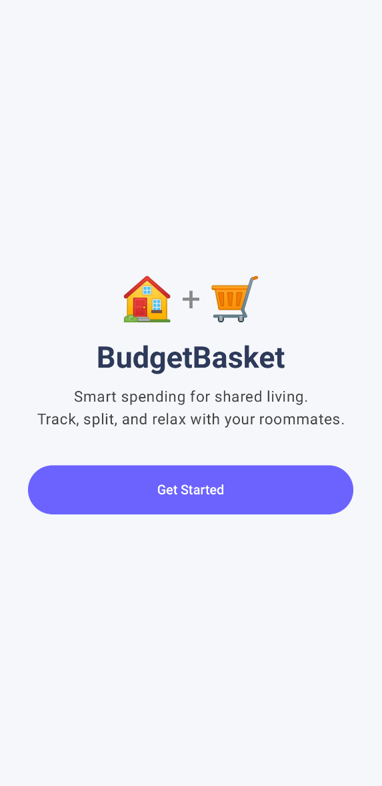
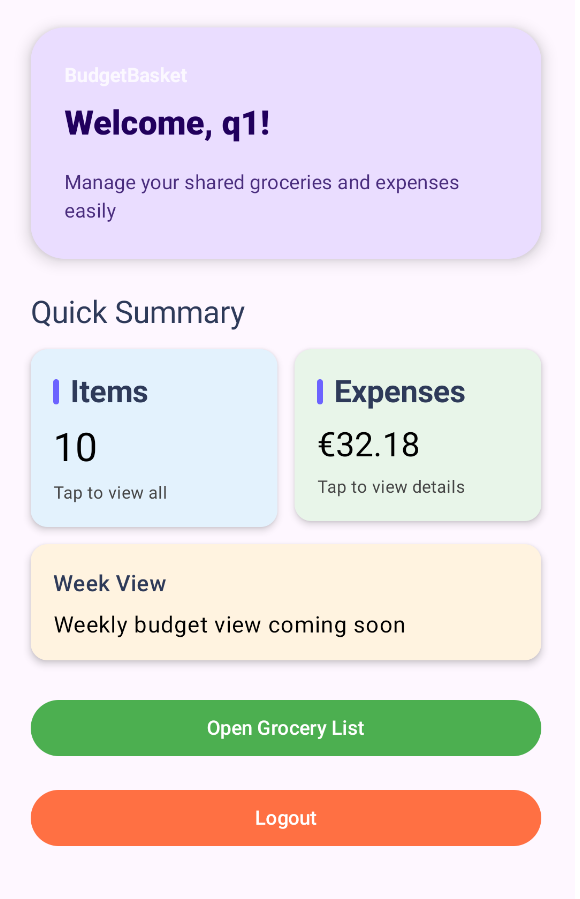
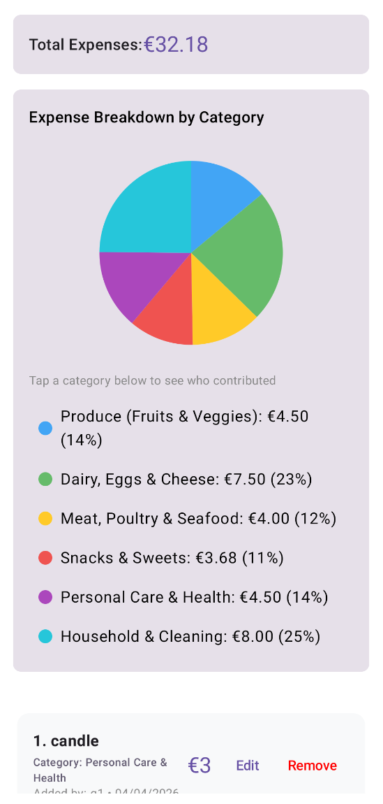

# OurBudgetBasket 🏠 + 🛒

OurBudgetBasket is a smart expense-tracking Android application designed for shared living. Whether you're managing a household or living with roommates, BudgetBasket helps you track, split, and visualize your grocery spending with ease.

## ✨ Key Features

- **Join or Create Apartment Groups**: Easily collaborate by joining a group via a unique Group ID. Keep all your household expenses in one synchronized place.
- **Collaborative Expense Logging**: Everyone in your group can add, view, and track grocery items in real-time.
- **Secure Ownership**: Data integrity is maintained by ensuring that only the item's owner can edit or remove their specific entries.
- **Visual Spending Insights**: Visualize your expenses through automatic pie charts that break down spending by category (Produce, Meat, Dairy, etc.) and by week.
- **Faster Settle-Ups**: View total costs and spending distributions to make settling up with roommates quick and transparent.

## 🛠️ Tech Stack

- **Language**: [Kotlin](https://kotlinlang.org/)
- **UI Framework**: [Jetpack Compose](https://developer.android.com/jetpack/compose) with Material 3
- **Backend & Database**: [Firebase Authentication](https://firebase.google.com/docs/auth) and [Cloud Firestore](https://firebase.google.com/docs/firestore)
- **Architecture**: MVVM (Model-View-ViewModel)

## 🚀 Getting Started

### Prerequisites

- Android Studio Flamingo (or newer)
- A Firebase project with Authentication and Firestore enabled.

### Setup

1. **Clone the repository**:
   ```bash
   git clone https://github.com/MickyOulu/budgetbasket-app.git
   ```
2. **Firebase Configuration**:
   - Download your `google-services.json` from the Firebase Console.
   - Place it in the `app/` directory of the project.
3. **Build and Run**:
   - Open the project in Android Studio.
   - Sync Gradle files.
   - Run the application on an emulator or physical device.

## 📱 Screenshots

| Welcome Screen | Dashboard | Grocery List |
| :---: | :---: | :---: |
|  |  |  |

## 📝 License

This project is licensed under the MIT License.
