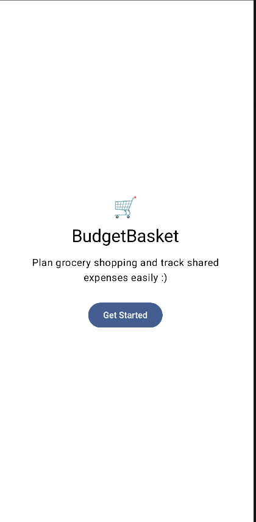
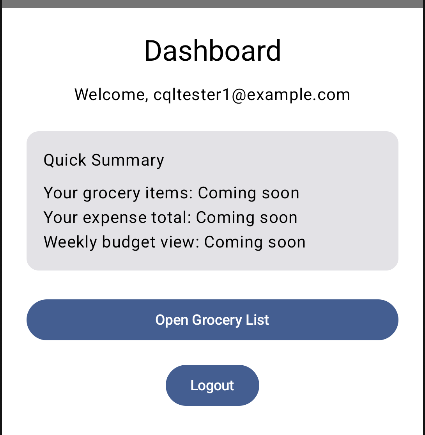
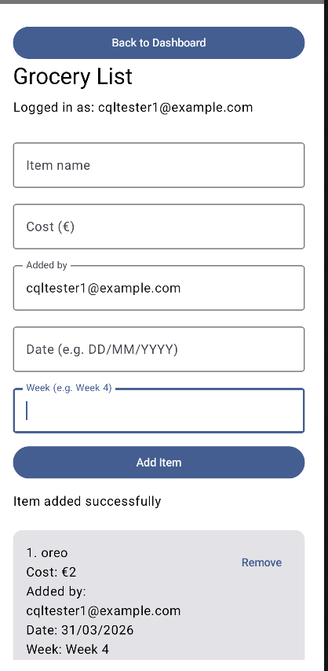

# BudgetBasket

BudgetBasket is an Android application designed to help users manage shared grocery shopping and track expenses efficiently. Whether you're living with roommates or managing a household, BudgetBasket simplifies the process of creating shopping lists and keeping an eye on your monthly budget.

## 🚀 Features

- **User Authentication:** Secure login and sign-up using Firebase.
- **Personalized Dashboard:** A central hub to access all app features.
- **Grocery List Management:** Create and manage your shopping lists in real-time.
- **Shared Access (Planned):** Collaborate with others on shared lists.
- **Expense Tracking (Planned):** Keep track of how much you spend on groceries.
- **Monthly Budget (Planned):** Set and monitor your monthly spending goals.

## 🛠️ Tech Stack

- **Language:** [Kotlin](https://kotlinlang.org/)
- **UI Framework:** [Jetpack Compose](https://developer.android.com/jetpack/compose)
- **Backend:** [Firebase Authentication](https://firebase.google.com/docs/auth) (and Firestore)
- **Architecture:** MVVM (Model-View-ViewModel) - *Assuming standard modern practice*
- **Design:** [Material 3](https://m3.material.io/)

## 📸 Screenshots

 



## 🏁 Getting Started

### Prerequisites

- Android Studio Flamingo or newer.
- A Firebase project set up in the [Firebase Console](https://console.firebase.google.com/).

### Installation

1. Clone the repository:
   ```bash
   git clone https://github.com/your-username/budgetbasket-app.git
   ```
2. Open the project in Android Studio.
3. Add your `google-services.json` file to the `app/` directory.
4. Sync the project with Gradle files.
5. Run the app on an emulator or a physical device.

## 🚧 Current Status

The project is currently in the **active development** phase. Core authentication and the basic grocery list structure are implemented. Expense tracking and budget analysis features are coming soon.

## 📄 License

This project is licensed under the MIT License - see the [LICENSE](LICENSE) file for details.
